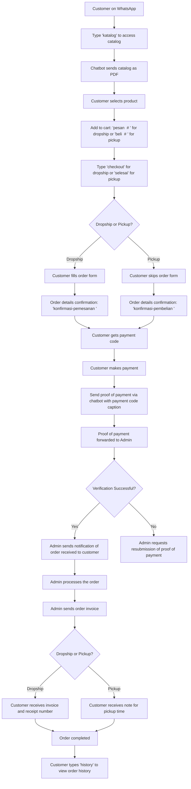

<div align="center">


## Chatbot HANI BC Cilacap 3 x Google Gemini

_Lightweight, Customizable WhatsApp Bot_

<p align="center">
  <a href="https://github.com/rizzzky78"></a>
</p>

## [](https://www.javascript.com) [](https://nodejs.org/) [](https://www.mongodb.com)

</div>

## Library Used

- @adiwajshing/baileys
- @adiwajshing/keyed-db
- @google/generative-ai
- mongodb
- axios
- chalk
- cron
- crypto-random-string
- jspdf
- module-alias
- winston

---

## 🤖 Main Features

Integrated with [**Google Gemini Generative AI**](https://ai.google.dev/gemini-api/docs).

Google Gemini is a family of AI models that can help with creativity and productivity. Gemini can understand and generate text, images, audio, videos, and code. It can also perform multimodal dialogue, game creation, visual puzzles, and more.

This integration is also include for:
- Search product data (details)
- Get order data for managing purposes
- Related information and so on

---

## 📝 Admin Features (strict)

- Manage product (access, upload, update/edit, delete)
- Manage orders (access, accept, reject, send invoices)
- Get single/all ongoing orders
- Get single/all transaction proof
- Get list products
- Access check shipping cost

---

## 📝 Customer Features (individual)

- Access catalogue
- Access products information
- Add product to bucket
- Make orders (dropship/pickup)
- Upload payment proof
- Receive invoices (image and PDF)
- Access purchase history
- Access data for completed order
- Access admin contact

## 💿 Installation

- Install the dependency module (required)

```cmd
$ npm install
```

- Install Nodemon globaly for development mode (required for run in development mode)

```cmd
$ npm install nodemon -g
```

- Install PM2 globaly for run in production mode (required for run in production mode)

```cmd
$ npm install -g pm2
```

- Create a **Mongodb Atlas** account and **Clusters**, and then get the URIs, [See at Youtube](https://www.youtube.com/results?search_query=how+to+create+mongodb+atlas+account)
- Create a [Raja Ongkir](https://rajaongkir.com/) account and then get the **APIKEY**
- Open `.ENV file` in root aplication, heres the ENV fields look like

```env
# CONFIGURATION

# MODE = DEVELOPMENT / PRODUCTION , switch the run mode
MODE = DEVELOPMENT

# MongoDB Atlas URI, place your mongodb uri in here
MONGODB_URI = YOUR_MONGODB_URI

# Google Gemini API key
GEMINI_APIKEY = YOUR_GEMINI_APIKEY

# MongoDB Atlas Database Name
DB_NAME = YOUR_MONGODB_ATLAS_DATABASE_NAME

RAJA_ONGKIR_APIKEY = YOUR_RAJA_ONGKIR_APIKEY

# METADATA

# Browser User Agent
USER_AGENT = Halal-Mart-Cilacap-3
# Session Developer, can be modified
SESSION_DEV = Developers
# Session Production, can be modified
SESSION_PROD = HalalMartBC3

# Chatbot Name, can be modified
CHATBOT_NAME = Chatbot HANI
# Marketplace Name, can be modified
MARKETPLACE_NAME = Halal Mart BC Cilacap 3
# Organization Name, can be modified
ORGANIZATION_NAME = HNI HPAI

# SUPER ADMIN, the contact for chatbot to sent the forwarded orders data
SUPER_ADMIN_NAME = Rizky
SUPER_ADMIN_PHONE = 6281329585825
SUPER_ADMIN_ID = 6281329585825@s.whatsapp.net

# COMMON ADMIN, same privilege as super admin
ADMIN_1_NAME = Rizky Example
ADMIN_1_PHONE = 6281329585825
ADMIN_1_PHONE_ID = 6281329585825@s.whatsapp.net
ADMIN_1_ROLE = Owner Marketplace

ADMIN_2_NAME = Example Admin
ADMIN_2_PHONE = 6281329585825
ADMIN_2_PHONE_ID = 6281329585825@s.whatsapp.net
ADMIN_2_ROLE = Developer Chatbot

# Override forwarded orders data, selection only can be "GROUP" or "SUPERADMIN"
# "GROUP" => orders and transactions are forwarded to group instead Super Admin
# "SUPERADMIN" => orders and transactions are forwarded to Super Admin instead Group
OVERRIDE_STATUS = SUPERADMIN
# Group Metdata ID
GROUP_ID_ONGOING_ORDERS = xxx@g.us.whatsapp.net
GROUP_ID_TRANSACTION = xxx@g.us.whatsapp.net

# List Payment, bellow can be modified, do not delete, you can modify the array payment at ./config/settings/index.js
PAYMENT_1_PROVIDER = BSI
PAYMENT_1_KEY = 081238392789
PAYMENT_1_ON_BEHALF = Rzky

PAYMENT_2_PROVIDER = BRI
PAYMENT_2_KEY = 081238392789
PAYMENT_2_ON_BEHALF = Rzky

PAYMENT_3_PROVIDER = GOPAY
PAYMENT_3_KEY = 081238392789
PAYMENT_3_ON_BEHALF = Rzky

PAYMENT_4_PROVIDER = BCA
PAYMENT_4_KEY = 081238392789
PAYMENT_4_ON_BEHALF = Rzky

PAYMENT_5_PROVIDER = DANA
PAYMENT_5_KEY = 081238392789
PAYMENT_5_ON_BEHALF = Rzky
```

- Run the app using command, or by open `start app.sh` file in the app root.

```cmd
$ node app.js
```

- Scan the QR to login
- Wait until the app configure the login state (eta 2-5 minutes), then close the app using key `CTRL + C` in terminal to terminate app
- Login successful, go to the next step

---

## Override Group Forwarded Orders and Transactions (optional)

You can override chatbot to forward the orders and transactions data to Group instead to Super Admin.

- Use command `get-group-id` to get the Group Id
- Paste the the Group Id into `.env` file, can be **GROUP_ID_ONGOING_ORDERS** or **GROUP_ID_TRANSACTION** prefer what you want
```env
OVERRIDE_STATUS = GROUP
GROUP_ID_ONGOING_ORDERS = example123@g.us.whatsapp.net
GROUP_ID_TRANSACTION = example123@g.us.whatsapp.net
```
- Change the **OVERRIDE_STATUS** var **SUPERADMIN** in `.env` to var **GROUP**
- Done!

## PM2 Link (required for production mode)

You can link PM2 using **public** and **private** key from official website [PM2 Keymetrics](https://pm2.keymetrics.io/)

- Go to App [PM2 IO](https://app.pm2.io/)
- Create buckets
- Copy the public and private key
- Paste it to terminal

---

## Run in Development Mode (auto restart if has file changes/modify)

Using command, or by open `start development.sh` file in app root.

```cmd
$ npm run dev
```

## Run in Normal Mode (no restart)

Using command, same as initial setup or by open `start app.sh` in app root.

```cmd
$ node app.js
```

## Run in Production Mode (auto restart, online 24 hours)

The production run mode by default using cron restart interval set to 4 hours.

Or, you can modify the app name and restart interval in `package.json`.

Cronjob `--cron-restart=\"0 */4 * * *\"` is set to 4 hours, you can modify the number in `package.json` at app root.

```json
"scripts": {
  "start": "node app.js --color",
  "prod": "pm2 start app.js --name \"Hani\" --cron-restart=\"0 */4 * * *\" && pm2 log",
  "dev": "nodemon app.js --color"
},
```

Using command to run in production mode, or by open `start production.sh` file in app root.

```cmd
$ npm run prod
```

---

## Command Module

Chatbot has a _module.exports_ that contain module used as command module.

You can find the `type.d.ts` at `./libs/builders/command/index.d.ts`.

```ts
import { WAMessage, WASocket } from "@adiwajshing/baileys";
import { Serialize } from "@libs/utils/serialize";

interface CommandObject {
  client: WASocket;
  message: WAMessage;
  command: string;
  prefix: string;
  args: string[];
  fullArgs: string;
  msg: Serialize;
}

/**
 * **Command Builder**
 * @description Class command builder
 */
export class ICommand {
  /**
   * @description Command alias
   * @example aliases: ['blabla', 'blabla']
   */
  aliases?: string[];

  /**
   * @required
   * @description Command category (will use to build help command)
   * @example category: 'downloader'
   */
  category: "admin" | "customer" | "forms";

  /**
   * @required
   * @description Command description
   * @example description: 'Something Downloader'
   */
  description: string;

  /**
   * @description Command permission
   */
  permission?: "admin" | "common";

  /**
   * @description If true and not group and not admin will send forbidden message
   * @example adminOnly: true
   */
  adminOnly?: boolean;

  /**
   * @description If true and not group will send forbidden message
   * @example groupOnly: true
   */
  groupOnly?: boolean;

  /**
   * @description If true and not private will send forbidden message
   * @example privateOnly: true
   */
  privateOnly?: boolean;

  /**
   * @description Minimum argument, for example command without args will send required minimun args message
   * @example minArgs: 1
   */
  minArgs?: number;

  /**
   * @description Expected argument
   * @example expectedArgs: '<link1> <link2>'
   */
  expectedArgs?:
    | "<ORD-ID-XXX>"
    | "<TRX-ID-XXX>"
    | "<ORD-ID-XXX VIA>"
    | "<INV-ID-XXX>"
    | "<QUERY # QTY>"
    | "<QUERY>"
    | "<QUERY FORMS>"
    | "none";

  typeArgs?: "query" | "forms" | "none";

  /**
   * @description Example use of the command
   * @example example: '{prefix}{command} [args]'
   */
  exampleArgs?: string;

  /**
   * @description Send waiting message before execute the callback function
   * @example waitMessage: true
   */
  waitMessage?: boolean | string;

  /**
   * @description Cooldown command
   * @example cooldown: 10 * 1000 // 10 seconds
   */
  cooldown?: number;

  /**
   * **Callback Async Function**
   * @required
   * @description Callback to execute command function
   * @example callback: async ({ msg }) => await msg.reply('Hello World!')
   */
  callback: (obj: CommandObject) => Promise<AwaitableMediaMessage>;
}

/**
 * Wrap the CMD module
 */
interface CommandModule extends ICommand {}

/**
 * Typeof promises as pass to baileys WA Socket
 */
interface AwaitableMediaMessage extends any {}
```

## Command Module Usage Example

The example use cases for CMD module. CMD module only accept in folder `./commands/...`.

Example use cases for **Search Product** features.

```ts
const { commonMessage } = require("@config/messages");
const { Moderation } = require("@controllers/admin");
const { CustomerInterface } = require("@function/distributor-data");
const { Converter } = require("@function/tools");
const logger = require("@libs/utils/logger");

/**
 * @memberof Customer
 * @type { import('@libs/builders/command').ICommand }
 */
module.exports = {
  aliases: ["cari", "cariproduk"],
  category: "customer",
  permission: "common",
  typeArgs: "query",
  expectedArgs: "<QUERY>",
  exampleArgs: "Andrographis",
  description: `Mencari produk dan menampilkannya berdasarkan nama produk yang terdapat pada Katalog.`,
  cooldown: 5 * 1000,
  callback: async ({ client, msg, fullArgs }) => {
    if (!fullArgs || fullArgs.length < 3) {
      return msg.reply(commonMessage("invalid_QuerySearchProduct"));
    } else {
      client
        .sendMessage(msg.from, {
          text: commonMessage("waitMessage"),
        })
        .then(async () => {
          await Moderation.searchProductByTitle(fullArgs)
            .then(async ({ status, data: productData }) => {
              if (status === "failed") {
                return msg.reply(
                  commonMessage("notFound_SearchedProductNotExist")(
                    fullArgs.trim()
                  )
                );
              }
              const matchedProducts = productData.slice(0, 3);
              client
                .sendMessage(msg.from, {
                  text: commonMessage("notification_ShowsSearchedProducts")(
                    matchedProducts.length,
                    fullArgs.trim()
                  ),
                })
                .then(async () => {
                  matchedProducts.forEach((v) => {
                    setTimeout(async () => {
                      const { caption, image } =
                        CustomerInterface.displayProduct(v);
                      return client.sendMessage(msg.from, {
                        caption,
                        image: await Converter.base64ToBufferConverter(image),
                      });
                    }, 2000);
                  });
                });
            })
            .catch((e) => {
              logger.error(e);
              console.log(e);
              return msg.reply(commonMessage("errorMessage"));
            });
        });
    }
  },
};
```

---

## Data Structure

The chatbot has static data shape/structure, you can find the `types.d.ts` file in `./interface/...`. But also considering the app controller to prevent app from crashing.

- Customer

```ts
export type CustomerMetadata = {
  customerId: string;
  tagName: string;
  phoneNumber: string;
  hniId?: string;
  registeredOn: string;
};

/**
 * Customer Buckets
 * A container for Customer to append product into bucket, and then make a checkout to process the order.
 */
export type Buckets = {
  /** ids for key of each element */
  id?: string;
  /** product id */
  productId: string;
  /** product names */
  productName: string;
  /** product category */
  category: ProductCategory;
  /** prices for each single product */
  price: number;
  /** poin gained each per product */
  poin: number;
  /** net weight each per product */
  weight: number;
  /** quantity of product for a single type product */
  qtyAmount: number;
  /** total price accumulated, `qty * price each` */
  totalPrice?: number;
  /** total poin accumulated, `qty * poin each` */
  totalPoin?: number;
  /** total weight accumulated, `qty * weight` */
  totalWeight?: number;
};

export type Order = {
  buckets: Buckets[];
  totalItem: number;
  totalPrice: number;
  totalPoin: number;
  totalWeight: number;
  totalExactPrice: number;
  additionalInfo: string;
  orderer: [name: string, phone: string, hniId?: string];
  expedition?: ExpeditionDetails;
  recipient: {
    adminNote?: string;
    metadata: [name: string, phone: string, hniId?: string];
    fullAddress?: [
      province: string,
      district: string,
      subDistrict: string,
      postalCode: string,
      details: string
    ];
    rajaOngkir: CourierResult[];
  };
};

export type Purchases = {
  orderId: string;
  orderType: OrderType;
  timeStamp: string;
  isCompleted: boolean;
  isPayed: boolean;
  payedVia: PaymentProvider;
  invoices?: CustomerInvoice;
  data: Order;
};

/**
 * Customer Data Shape
 */
export type Customer = {
  metadata: CustomerMetadata;
  data: {
    buckets: Buckets[];
    purchaseHistory: Purchases[];
  };
};
```

- Product Data

```ts
export type ProductCategory = "herbal" | "beverages" | "cosmetics";
export type ProductDataInfo = {
  title: string;
  category: ProductCategory;
  price: number;
  memberPrice: number;
  stock: number;
  sold: number;
  poin: number;
  weight: number;
  image: string;
  description: string;
};

export type Product = {
  productId: string;
  timeStamp: string;
  data: ProductDataInfo;
};
```

- Order Data

```ts
export type StatusOrder =
  | "never-order" // default status, indicates customer has never order or not found with exact search parameter
  | "pending" // status when customer submit form order
  | "forwarded" // status when customer confirm order with orderId
  | "confirmed" // status when admin receive and confirm ordered stuff availabe
  | "completed"; // status when the order has successfully completed

export type ExpeditionProvider = "JNE" | "TIKI" | "POS" | "NOT-SET";

export type AdminConfirmedData = {
  hashId: string;
  totalExactPrice: number;
  expedition: ExpeditionDetails;
};

/**
 * @property Customer
 * Data individual (data pemesanan keseluruhan), relasi dengan data Customer.
 */
export type CustomerOrderData = {
  /** Orderer Phone Number */
  ordererId: string;
  ordererName: string;
  hniId?: string;
  status: StatusOrder;
  metadata: AdminConfirmedData;
  data: Purchases;
};
```

- Payment Data

```ts
export type CustomerPaymentProof = {
  timeStamp: string;
  isVerified: boolean;
  metadata: {
    orderId: string;
    transactionId: string;
  };
  payer: {
    custId?: string;
    tagName: string;
    phoneNumber: string;
  };
  payment: {
    via: PaymentProvider;
    nominal: number;
    image: string;
  };
};
```

- Completed Order

```ts
export type ApprovalOrderData = {
  orderType: OrderType;
  orderId: string;
  transactionId: string;
  timeStamp: string;
  invoice: CustomerInvoice;
  metadata: {
    custId: string;
    orderer: string;
    phone: string;
    hniId: string;
    info: string;
    adminNotes: string;
  };
  payment: {
    product: number;
    expFees: number;
    via: PaymentProvider;
    nominal: number;
  };
  expedition: ExpeditionDetails;
  products: Buckets[];
};
```

---

## Controllers

You can find the class controller of the whole app in `./controllers/...`. The controller is split into two folder `admin` and `customer`.
List of all class controller

- Admin, this class is not instanceable

```ts
class Moderation {
  // class children
}

class Admin {
  // class children
}
```

- Customer, this class is not instanceable

```ts
class Customer {
  // class children
}
```

## Template Message

You can find the locale text message template in `./config/messages/locale.js`, this contain msg object **commonAdminRegularMessage** and **commonCustomerRegularMessage**.

The root of function message is on `./config/messages/index.js`.

```ts
const {
  commonAdminRegularMessage,
  commonCustomerRegularMessage,
} = require("./locale");

/**
 * Customer Message Template
 * @param { Partial<keyof typeof commonCustomerRegularMessage> } messageKey
 * @returns { string | (value: string) => string }
 */
function commonMessage(messageKey) {
  return commonCustomerRegularMessage[messageKey];
}

/**
 * Admin Message Template
 * @param { Partial<keyof typeof commonAdminRegularMessage> } messageKey
 * @returns { string | (value: string) => string }
 */
function moderationMessage(messageKey) {
  return commonAdminRegularMessage[messageKey];
}
```

## Flow Diagram Logic

Chatbot System



## End

Special thanks to God, me, and my Computer :)
